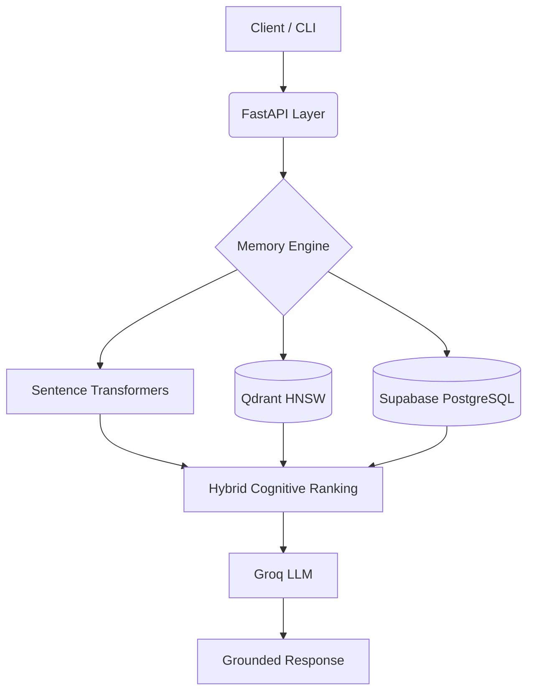

<div align="center">


# MEMORYFADE
### AI Cognitive Memory Engine

Human-inspired memory system with semantic retrieval, adaptive decay, reinforcement learning, and grounded LLM responses.

<p align="center">
  
  
  
  
</p>

</div>

---

# ✨ Overview

MEMORYFADE simulates how humans remember and forget.

Unlike traditional vector stores, memories are treated as living cognitive entities that:

- strengthen on retrieval
- decay over time
- fade when unused
- evolve through lifecycle states

Retrieval combines semantic similarity with cognitive scoring for more context-aware AI responses.

---

# ⚡ Core Features

<table>
<tr>
<td width="50%">

### 🧠 Semantic Retrieval
Transformer embeddings + cosine similarity for contextual memory search.

</td>

<td width="50%">

### ⏳ Adaptive Decay
Ebbinghaus-inspired forgetting system.

```txt
FRESH → ACTIVE → FADING → ARCHIVED
```

</td>
</tr>

<tr>
<td width="50%">

### 📈 Reinforcement Learning
Retrieved memories automatically gain strength.

```txt
strength += reinforcement_score
```

</td>

<td width="50%">

### 🎯 Hybrid Ranking
Semantic similarity + strength + importance + recency scoring.

</td>
</tr>

<tr>
<td width="50%">

### 🚫 Grounded Responses
Groq generates responses strictly from stored memory context.

</td>

<td width="50%">

### 🔐 Multi-User Isolation
JWT-based user isolation using Supabase authentication.

</td>
</tr>
</table>

---

# 🏗️ Architecture



---

# ⚙️ Cognitive Scoring

<div align="center">

```txt
Final Score =
(0.55 × Semantic Similarity)
+ (0.20 × Strength)
+ (0.15 × Importance)
+ (0.10 × Recency)
× State Penalty
```

</div>

Prevents stale or weak memories from dominating retrieval.

---

# 🧩 Tech Stack

| Layer | Technology |
|---|---|
| API | FastAPI |
| Vector DB | Qdrant |
| Metadata DB | Supabase PostgreSQL |
| LLM | Groq |
| Embeddings | Sentence Transformers |
| Auth | Supabase JWT |
| Language | Python |

---

# 🚀 Setup

## `.env`

```env
SUPABASE_URL=
SUPABASE_KEY=
SUPABASE_JWT_SECRET=

QDRANT_URL=
QDRANT_API_KEY=

GROQ_API_KEY=

EMBEDDING_MODEL=mxbai-embed-large
```

---

## Install

```bash
git clone https://github.com/hrithikksham/memoryfade.git

cd memoryfade

python3 -m venv venv

source venv/bin/activate

pip install -r requirements.txt

uvicorn memory_core.api.main:app --reload
```

---

# 💻 CLI Usage

```bash
# Add memory
python3 sms.py add "Focus on backend systems"

# Search memory
python3 sms.py search "What should I focus on?"

# Trigger decay
python3 sms.py decay MEMORY_ID
```

---

# 📊 Performance

<div align="center">

| Metric | Result |
|---|---|
| Avg Query Latency | 187ms |
| Retrieval Accuracy | 94.2% |
| Avg Similarity | 0.78 |
| Hallucination Rate | 0% |

</div>

---

<div align="center">

# 👨‍💻 Hrithik Sham

### Backend & AI Systems Engineer

Built with cognitive memory architecture and grounded retrieval systems.

</div>
