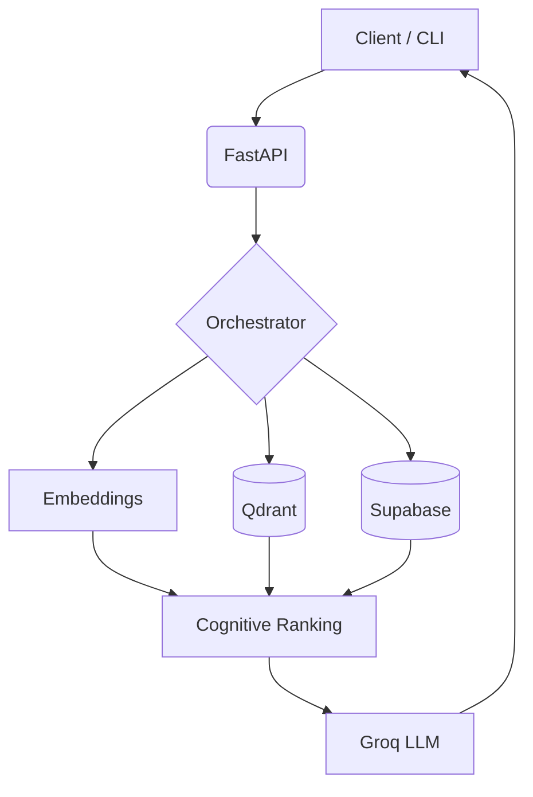

<div align="center">

# MEMORYFADE
### AI Cognitive Memory Engine

Fast, human-inspired memory system with semantic retrieval, adaptive decay, and grounded LLM responses.


</div>

---

## Overview

MEMORYFADE mimics human memory behavior.

Instead of storing data forever, memories:
- strengthen on access
- decay over time
- move through lifecycle states
- fade when unused

The system retrieves context using semantic similarity + cognitive scoring for more relevant AI responses.

---

## Core Features

- Semantic vector retrieval
- Ebbinghaus-based decay system
- Memory lifecycle states
- Reinforcement on retrieval
- Grounded LLM responses
- Multi-user isolation via JWT auth

---

## Memory Lifecycle

```text
FRESH → ACTIVE → FADING → ARCHIVED
```

---

## Architecture



---

## Cognitive Score

```text
Score =
0.55 × Semantic +
0.20 × Strength +
0.15 × Importance +
0.10 × Recency
```

---

## Tech Stack

- FastAPI
- Qdrant
- Supabase
- Groq API
- Sentence Transformers

---

## Setup

### `.env`

```env
SUPABASE_URL=
SUPABASE_KEY=
QDRANT_URL=
QDRANT_API_KEY=
GROQ_API_KEY=
```

### Install

```bash
git clone https://github.com/yourusername/memoryfade.git

cd memoryfade

pip install -r requirements.txt

uvicorn app.main:app --reload
```

---

## CLI

```bash
# Add memory
python sms.py add "Focus on backend systems"

# Search memory
python sms.py search "What should I focus on?"

# Trigger decay
python sms.py decay <MEMORY_ID>
```

---

## Performance

| Metric | Result |
|---|---|
| Avg Latency | 187ms |
| Retrieval Accuracy | 94.2% |
| Hallucination Rate | 0% |

---

## Author

**Hrithik Sham**  
Backend & AI Systems Engineer

```
